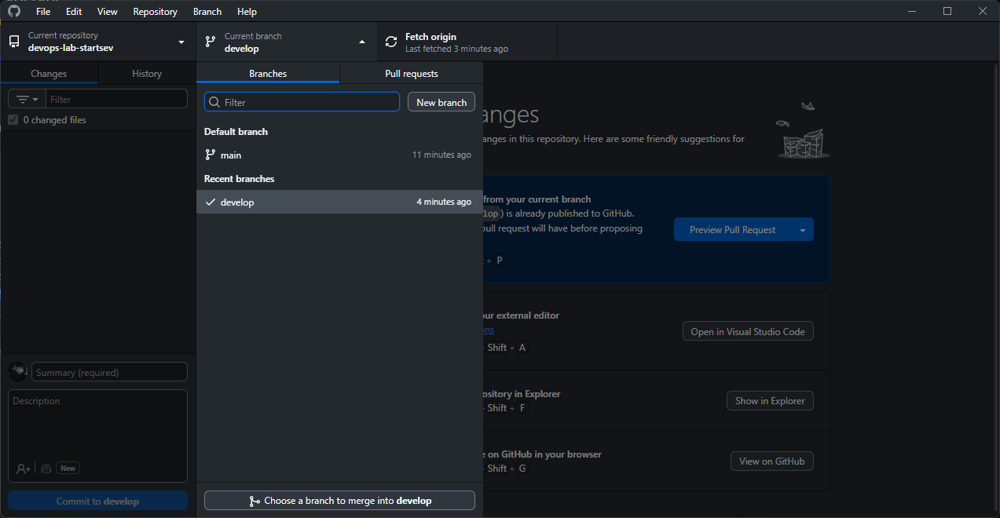
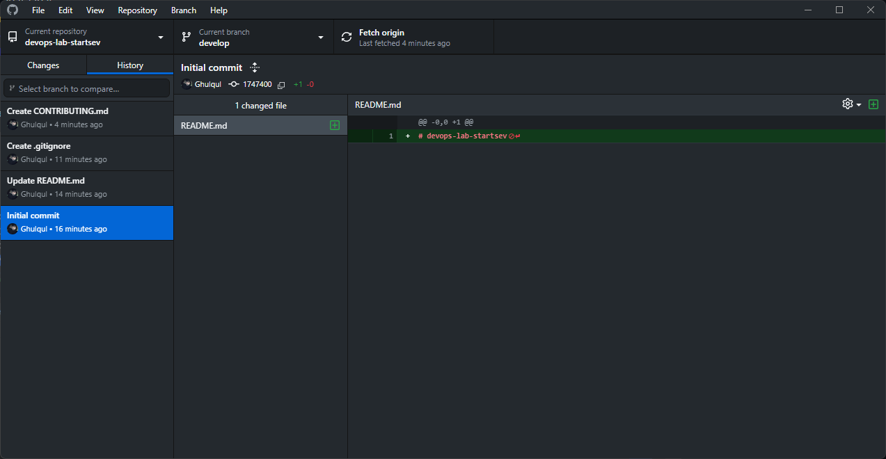
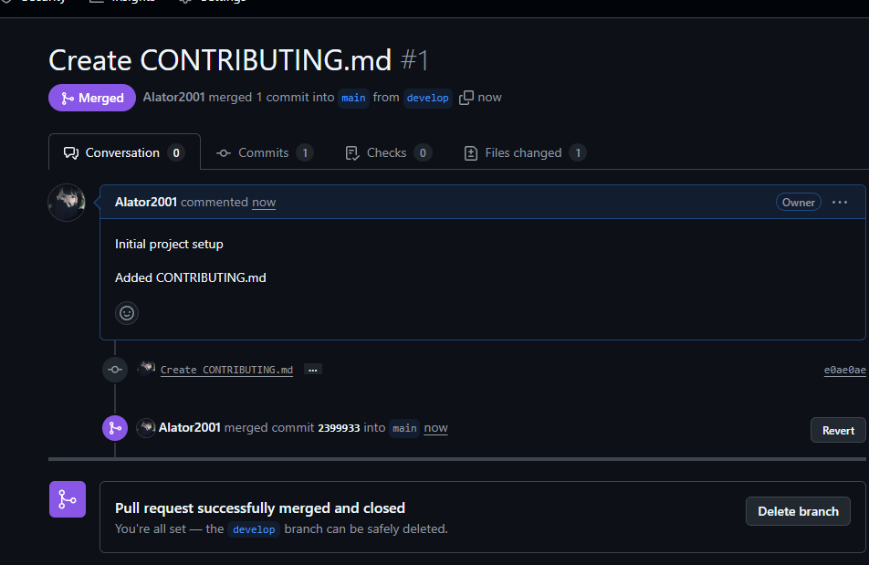

# ITMO University  

**Faculty:** FTMI  
**Course:** Introduction in Web Technologies  
**Academic Year:** 2025 / 2026  

---

## Лабораторная работа №0  

**Group:** U4225  
**Author:** Startsev Daniil Vitalevich  
**Date of creation:** 29.09.2025  

---

## Ход работы

1. **Создание аккаунта и настройка SSH**  
   - Зарегистрирован аккаунт на GitHub.  

2. **Создание репозитория**  
   - В веб-интерфейсе GitHub создан новый репозиторий с названием `devops-lab-[Фамилия]`.  

3. **Клонирование репозитория**  
   - Репозиторий клонирован на локальную машину

4. **Файл README.md**  
   - Создан файл `README.md`, где указаны:  

5. **Файл .gitignore**  
   - Добавлен `.gitignore` с типовыми исключениями для ОС (Windows/Linux).  

6. **Работа с веткой develop**  
   - Создана новая ветка develop

   

7. **Файл CONTRIBUTING.md**  
   - Подготовлен файл с правилами участия
8. **Первый коммит**  
   - Создан коммит:  
   - Изменения отправлены в удалённый репозиторий

     

9. **Pull Request**  
   - В GitHub создан Pull Request из ветки `develop` в `main` с описанием изменений.  
  
10. **Слияние и удаление ветки**  
    - Pull Request принят и смержен.  
    - Ветка `develop` удалена через интерфейс GitHub.  

    