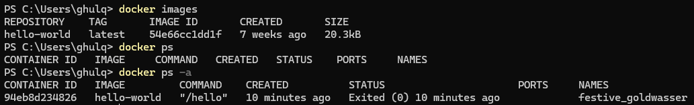
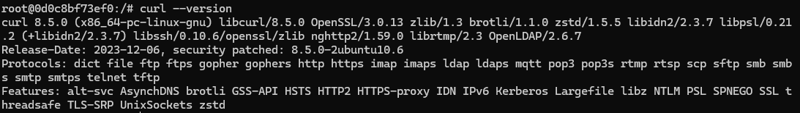
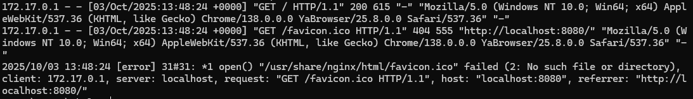
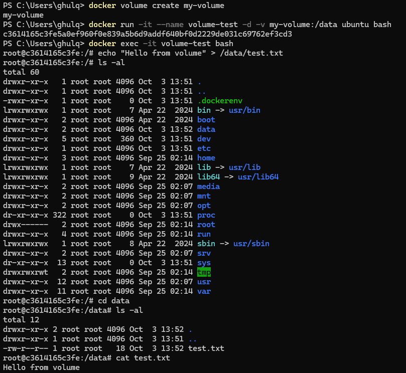
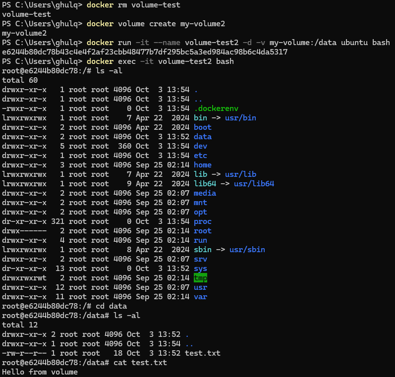
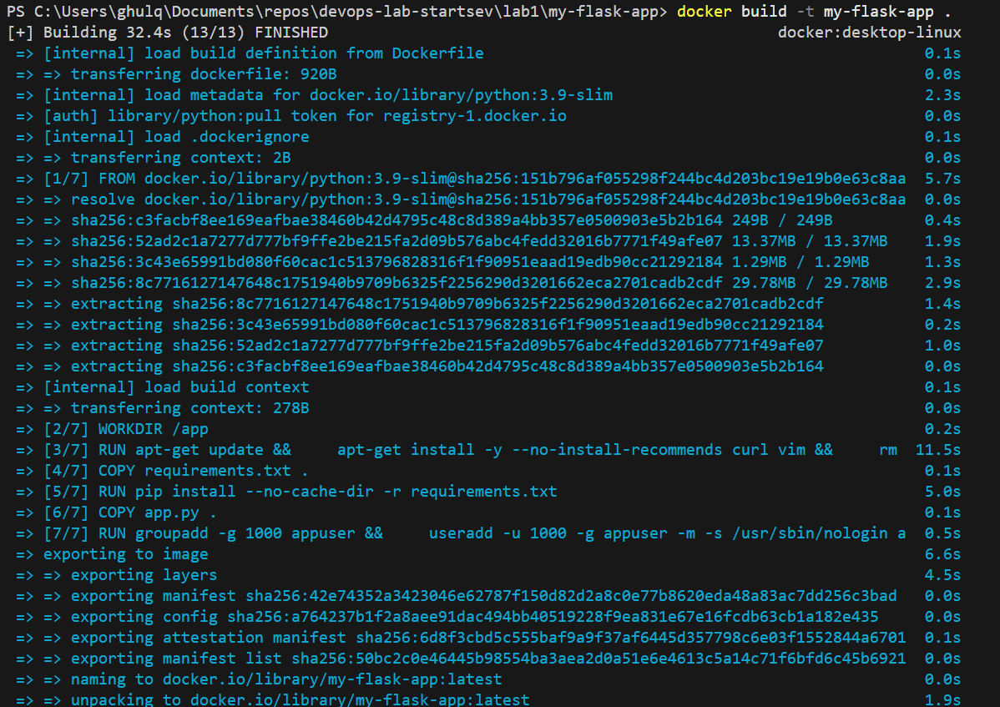
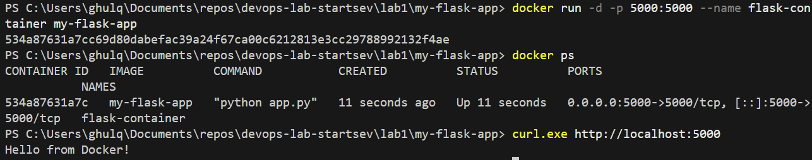

University: ITMO University  
Faculty: FTMI  
Course: Introduction in Web Technologies  
Year: 2025/2026  
Group: U4225  
Author: Startsev Daniil Vitalevich  
Lab: Lab1  
Date of create: 03.10.2025  

---

## Цели и задачи  
Опыт работы с Docker: запуск контейнеров, создание образов, управление томами, создание собственного Dockerfile и развертывание простого Flask-приложения.

## Описание среды  
- ОС: Windows 11  
- Версия Docker: `docker --version` → *<28.4.0>*  

## Ход работы

### Шаг 1. Запуск базовых контейнеров    
- `docker run hello-world` — проверка работоспособности Docker;  
- `docker pull ubuntu:latest` и запуск `docker run -it ubuntu bash`, установка `curl`, `vim` в контейнере;  
- команда `docker ps`, `docker ps -a`, остановка, удаление контейнеров, удаление образов.


### Шаг 2. Работа с готовыми образами (Ubuntu)

- Скачал и запустил образ:
  ```bash
  docker pull ubuntu:latest
  docker run -it ubuntu bash
  apt update && apt install -y curl
  curl --version
  ```


### Шаг 3. Запуск веб-сервера Nginx
- Запуск контейнера с образом nginx:  
  ```bash
  docker run -d -p 8080:80 --name web-server nginx:alpine
  docker logs web-server
  ```


### Шаг 4. Работа с томами (volumes)  
- Создание тома: `docker volume create myvol`;  
- Запуск контейнера с монтированием тома, создание файла внутри.

- Удаление контейнера, запуск нового с тем же томом и проверка, что файл сохранился.


### Шаг 5. Создание приложения и Dockerfile  
- Написание `app.py` (Flask-приложение) и `requirements.txt`.  
- Написание `Dockerfile` с условиями:
  1. Использование `python:3.9-slim`  
  2. `WORKDIR /app`  
  3. Установка системных пакетов `curl` и `vim`  
  4. Установка Python-зависимостей  
  5. Копирование `app.py`  
  6. Создание пользователя `appuser` с UID 1000  
  7. Переключение на `appuser`  
  8. `EXPOSE 5000`  
  9. `ENV FLASK_ENV=production`  
  10. `CMD ["python", "app.py"]`

- Сборка образа: `docker build -t my-flask-app .`

- Запуск контейнера: `docker run -d -p 5000:5000 --name flask-container my-flask-app`

## Проблемы и решения

> **Ошибка**: при запуске контейнера сразу выходил — `Exited (1)`  
> Логи показали:  
> ```
> cannot import name 'url_quote' from 'werkzeug.urls'
> ```

Flask 2.0.1 ожидает, что в версии `werkzeug` будет функция `url_quote`. Но в более новых версиях `werkzeug` она была удалена или переименована, поэтому импорт ломается.

**Решение:**  
Зафиксировал совместимую версию `werkzeug` в `requirements.txt`.  

Flask==2.0.1
Werkzeug==2.0.3

После этого:
- Удалил упавший контейнер: `docker rm flask-container`  
- Удалил образ: `docker rmi my-flask-app`  
- Пересобрал образ: `docker build -t my-flask-app .`  
- Запустил контейнер заново: `docker run -d -p 5000:5000 --name flask-container my-flask-app`

В результате приложение успешно запустилось и на `http://localhost:5000` возвращает `Hello from Docker!`.


## Выводы и самооценка  
- Считаю, что основная часть задания выполнена: создан Dockerfile, приложение работает внутри контейнера.  
- Затык с версией `werkzeug` показал важность фиксировать версии зависимостей.  
- В следующий раз стоит заранее проверять совместимость библиотек.