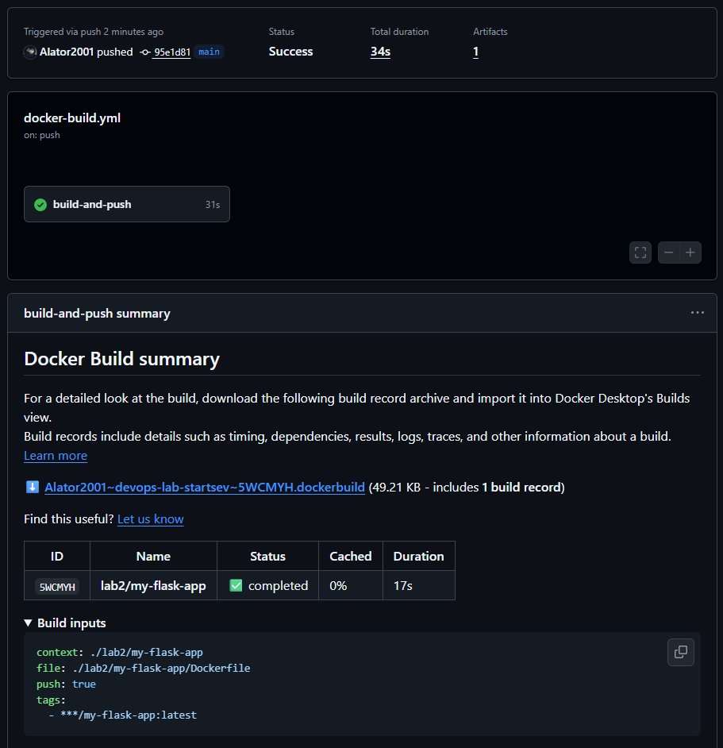
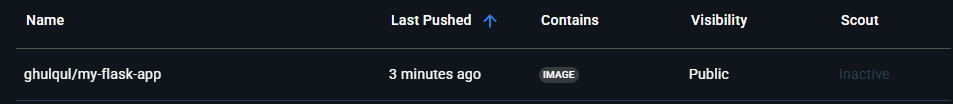
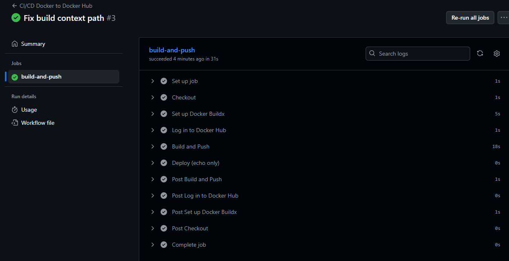
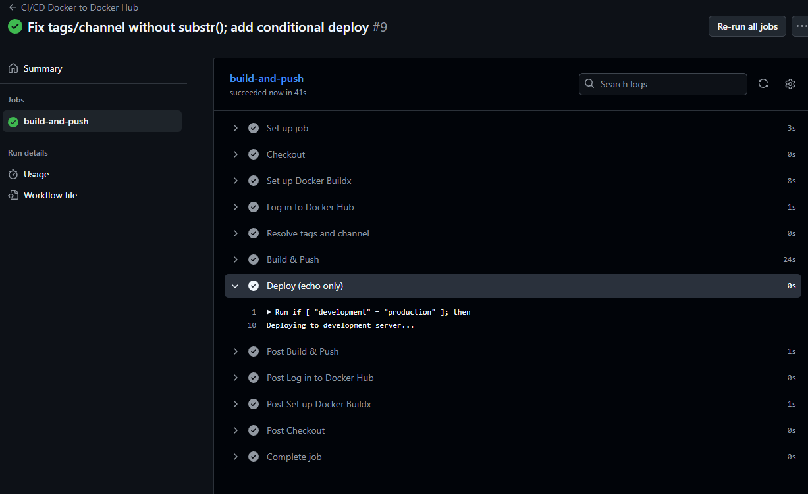
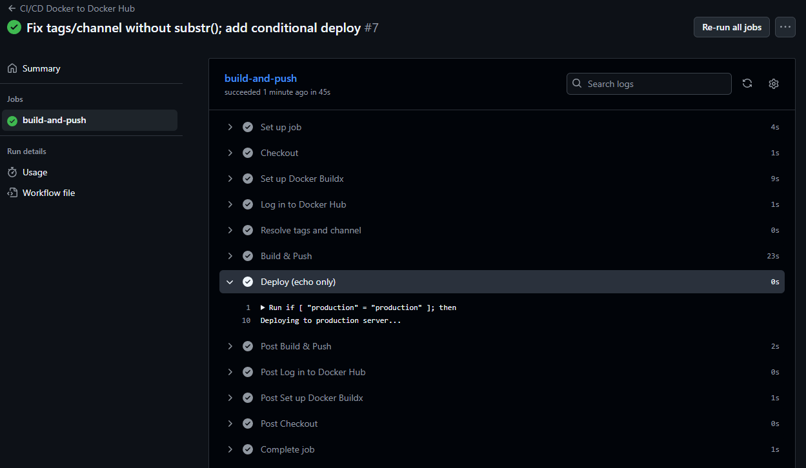

University: ITMO University  
Faculty: FTMI  
Course: Introduction in Web Technologies  
Year: 2025/2026  
Group: U4225  
Author: Startsev Daniil Vitalevich  
Lab: Lab 2 — Continuous Integration / Continuous Delivery  
Date of create: 07.10.2025  

---

## Цели и задачи  
Научиться настраивать CI/CD-пайплайн в GitHub Actions для автоматической сборки Docker-образов и их публикации в Docker Hub, а также реализовать условный деплой для веток main и develop.

## Ход работы

### Шаг 1. Подготовка Flask-проекта  
Создано простое Flask-приложение (`app.py`, `requirements.txt`, `Dockerfile`) в директории `lab2/my-flask-app`.  
Приложение возвращает тестовую строку при обращении к `/`.

---

### Шаг 2. Настройка репозитория и секретов  
- В разделе **Settings → Secrets and variables → Actions** добавлены секреты:  
  - `DOCKER_USERNAME` — логин Docker Hub;  
  - `DOCKER_PASSWORD` — access token Docker Hub.  

---

### Шаг 3. Создание CI/CD пайплайна  
В папке `.github/workflows/` создан файл `docker-build.yml`, определяющий автоматическую сборку и публикацию образа.  

Основные шаги workflow:  
1. **Checkout** кода.  
2. **Настройка Docker Buildx** для сборки.  
3. **Авторизация** в Docker Hub через секреты.  
4. **Сборка и push** образа в Docker Hub (ветки `main` и `develop`).  
5. **Условный деплой:**  
   - для `main` — `Deploying to production server...`;  
   - для `develop` — `Deploying to development server...`.  

---

## Шаг 4. Тестирование пайплайна  
- Сделать коммит и пуш в main ветку
- Проверить выполнение пайплайна в разделе Actions

- Убедиться, что образ появился в Docker Hub

- Проверить логи выполнения каждого шага

---

## Шаг 4. Тестирование пайплайна  (со звёздочкой)
- При пуше в ветку `develop` в GitHub Actions выполнились все шаги, в логах отобразилось сообщение  
  *“Deploying to development server...”*.  

- При пуше в `main` в логах выведено сообщение  
  *“Deploying to production server...”*.  

---

### Шаг 5. Проверка и анализ логов  
Вкладка **Actions** → запуск workflow → `build-and-push` показала успешное выполнение каждого шага:  

---

## Выводы и самооценка  
Работа выполнена полностью. Удалось освоить основы автоматизации CI/CD на GitHub и разобраться с типовыми ошибками контекста Docker.  
Считаю, что навык настройки пайплайна будет полезен при дальнейшей работе с микросервисами и облачными деплоями.